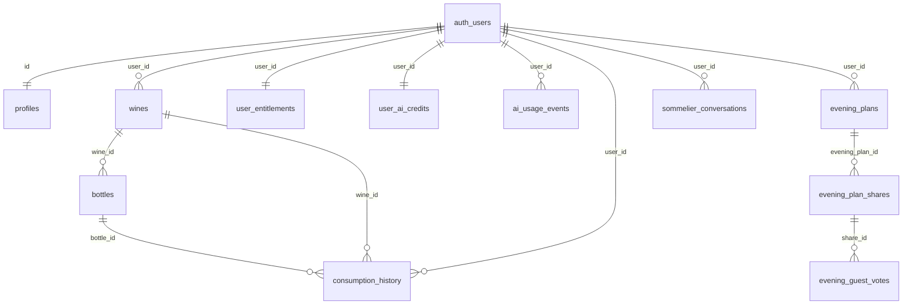

# Sommi (Wine) — Technical Audit Report

**Audit date:** 2026-08-23  
**Scope:** Read-only repository audit. No production database access. No application changes.  
**Product:** Sommi — AI-assisted personal wine cellar (React SPA + Supabase + Express API)

---

## 1. Executive Summary

### Overall technical health

Sommi has a **coherent core architecture** for a wine cellar: per-user `wines` (catalog identity) separated from `bottles` (inventory quantity), Supabase Auth + RLS, rich AI enrichment via Edge Functions, and a production web app under `apps/web` deployed to Vercel. The team has invested meaningfully in credits/billing, admin analytics, i18n (en/he), and observability (Sentry).

However, the repository also carries **significant production-risk debt**: privilege fields on `profiles` appear writable by end users under documented RLS, inventory open/undo is not transactional and has a confirmed multi-bottle undo bug, migration hygiene is uneven (orphan schemas, manual SQL in the migration folder, tables used by the app but absent from canonical migrations), and automated quality gates are weak (no CI, web typecheck fails extensively, almost no RLS/integration/e2e tests).

### Biggest strengths

- Clear **wines vs bottles** domain split with user-scoped RLS on core tables.
- **Credit mutations** locked to `service_role` via `process_ai_credit_usage` RPC (migration `20260419000000_lock_down_process_ai_credit_usage.sql`).
- **PKCE + Google OAuth** for primary auth; service role key not bundled in the Vite client.
- **Sentry** on web, API, and edge; structured admin RPCs with `is_admin()` checks inside `SECURITY DEFINER` functions.
- Primary cellar UI correctly sums **`quantity`** for bottle totals and paginates loads.

### Biggest risks

1. **Profiles privilege escalation (repository-confirmed policy gap; live exploitability needs confirmation)** — authenticated users can `UPDATE` their own `profiles` row with no column-level guard; `is_admin` and feature flags live on that table.
2. **Inventory integrity** — non-atomic open/undo; undo ignores `opened_quantity` (reachable from Open Ritual and History).
3. **Migration / schema drift** — `bottles_with_wine_info` references nonexistent `bottles.opened_at`; `shared_cellars` and `wishlist_items` not in canonical migration path; baby-tracker `001`–`003` migrations run before wine schema on fresh apply order.
4. **Abusable Vivino edge proxies** — no in-function auth, credits, or rate limits; CORS `*`.
5. **Production readiness gaps** — no CI, minimal tests, web TypeScript check fails (~500 errors), dependency audit reports 20 issues including 1 critical.

### Production readiness verdict

**Not ready for broad production use without remediation**, especially if admin tools, paid credits, or share links are enabled in production. Suitable for **limited beta** only with: (a) live verification that `profiles` privilege escalation is blocked at the database layer if not fixable immediately, (b) admin access restricted to known accounts, (c) acceptance of inventory/statistics edge cases until open/undo is fixed.

### Three most important next actions

1. **Database guard on `profiles`** — `BEFORE UPDATE` trigger or column privileges blocking `is_admin`, feature flags, and other privileged columns from `authenticated` role; verify with an RLS test.
2. **Transactional `open_bottles` / `undo_open` RPC** — single Postgres function with idempotency key; fix undo to restore `opened_quantity`.
3. **Migration hygiene** — add missing tables to ordered migrations, fix or drop broken view migration, quarantine manual SQL from `supabase/migrations/`, document/verify fresh `db reset` in an isolated environment.

---

## 2. Current Architecture

### Stack (repository-confirmed)

| Layer | Technology | Location |
|-------|------------|----------|
| Frontend (production) | React 18, Vite 5, TanStack Query, React Router 6, Tailwind, i18next | `apps/web/` |
| Hosting (web) | Vercel SPA | `vercel.json` |
| Backend (BaaS) | Supabase Postgres, Auth, Storage, Realtime, ~27 Edge Functions | `supabase/` |
| Backend (API) | Express 4, Zod | `apps/api/` |
| Billing | Paddle (client + webhook) | `apps/api/src/routes/billing.ts`, web Paddle JS |
| AI | OpenAI (edge + API), Perplexity (kosher) | `supabase/functions/`, `apps/api/` |
| Legacy | Prisma + SQLite, root `src/` baby-tracker scaffold | `apps/api/prisma/`, `src/` |

### Request / data flow

```mermaid
flowchart TB
  subgraph client [Browser_apps_web]
    UI[Pages_Components]
    Svc[Services_hooks]
    QC[TanStack_Query]
    UI --> Svc --> QC
  end

  subgraph supabase [Supabase]
    Auth[Auth_PKCE_Google]
    PG[(Postgres_RLS)]
    ST[Storage_buckets]
    EF[Edge_Functions]
  end

  subgraph api [Express_API_Railway_docs]
    Agent[/api/agent]
    Billing[/api/billing]
    Meta[/api/meta]
    GA[/api/analytics]
  end

  subgraph external [External]
    OpenAI[OpenAI]
    Vivino[Vivino_scrape]
    Paddle[Paddle]
    Sentry[Sentry]
  end

  client --> Auth
  Svc -->|supabase-js_RLS| PG
  Svc -->|invoke| EF
  Svc -->|fetch_Bearer_JWT| api
  EF --> PG
  EF --> OpenAI
  EF --> Vivino
  api --> PG
  api --> OpenAI
  api --> Paddle
  client --> ST
  client --> Sentry
  api --> Sentry
  EF --> Sentry
```

**Typical cellar read:** `CellarPage` → `bottleService.listBottles()` → Supabase `bottles` + nested `wines` select → client-side filter/sort on loaded page(s).

**Typical add bottle:** `bottleService.createBottle()` → upsert `wines` → insert `bottles` → async edge calls (analysis, pairing, kosher).

**Typical open bottle:** `OpenRitualSheet` / `CellarPage` → `historyService.markBottleOpened()` → insert `consumption_history` → update `bottles.quantity` (two calls, not transactional).

**Sommelier:** `AgentPageWorking` → Express `/api/agent` with Supabase JWT → `creditService` RPC → OpenAI orchestration.

### Domains implemented vs not

| Domain | Status |
|--------|--------|
| Users / profiles | Implemented |
| Wines (catalog per user) | Implemented |
| Bottles (inventory qty) | Implemented |
| Consumption history | Implemented |
| Drinking windows / readiness | Implemented (3 overlapping models) |
| Recommendations / agent / evening plans | Implemented |
| Wishlist | Implemented in code; schema migration outside canonical path |
| Shared cellars | Implemented in code; table SQL only at repo root |
| Credits / Paddle billing | Implemented |
| Cellar monetary value total | **Not implemented** |
| Collection export | **Not implemented** (mentioned in Terms) |
| Global/shared wine catalog | **Not implemented** (per-user wines) |
| Separate vintages table | **Not implemented** (vintage column on `wines`) |
| Workspaces / babies | **Orphan** (`001`–`003`, root `src/`) |

---

## 3. Database Map

### Entity table

| Entity/Table | Purpose | Ownership | Important relationships | RLS | Main concerns |
|--------------|---------|-----------|----------------------|-----|---------------|
| `profiles` | User profile + flags | `id` = `auth.users` | 1:1 auth; referenced by sommelier tables | ON; own row CRUD + admin read-all | **Privileged columns writable via UPDATE policy** |
| `wines` | Wine catalog identity | `user_id` | → `bottles`; UNIQUE(user, producer, name, vintage) | ON; own CRUD | Cascade delete wipes inventory; NULL vintage uniqueness |
| `bottles` | Inventory rows (qty) | `user_id` | `wine_id` → `wines` CASCADE | ON; own CRUD | No FK enforcing `bottles.user_id = wines.user_id` |
| `consumption_history` | Open/drink events | `user_id` | `bottle_id`, `wine_id` CASCADE | ON; own CRUD | Lost on bottle delete; `opened_quantity` not respected on undo |
| `recommendation_runs` | Recommendation audit | `user_id` | — | SELECT+INSERT only | No UPDATE/DELETE policies |
| `wishlist_items` | Wish list | `user_id` | No FK to `wines` | ON (if table exists) | **Not in `supabase/migrations/`** |
| `shared_cellars` | Share link snapshots | `user_id` | — | ON (if table exists) | **Public SELECT if deployed**; not in canonical migrations |
| `evening_plans` / shares / votes | Plan evening + guests | `user_id` / share id | JSON queue refs | ON | `evening_guest_votes.wine_id` no FK |
| `sommelier_*` | Agent memory, events, drafts | `user_id` | bottle refs SET NULL | ON | Heavy JSONB |
| `user_entitlements` | Monetization flags | `user_id` PK | — | SELECT only | Writes service_role only ✓ |
| `user_ai_credits` | Credit balances | `user_id` UNIQUE | — | SELECT only | Writes via RPC ✓ |
| `ai_usage_events` | AI ledger | `user_id` | — | SELECT own; admin read-all | Append-only intent |
| `paddle_events` | Webhook audit | — | — | Deny all (USING false) | Service role only ✓ |
| `wine_events` / `user_event_states` | Calendar / dismiss | public / per-user | — | ON | — |
| `app_events` | Product analytics | user nullable | — | INSERT own/anon; SELECT admin | — |
| `admins` | Legacy admin list | `user_id` | Synced to `profiles.is_admin` | Bootstrap policies | Dual admin model |
| `workspaces`, `babies`, `events`… | Baby tracker | workspace | — | From `001`–`003` | **Orphan schema** |

### ER diagram (confirmed migrations)



---

## 4. Security and RLS Matrix

**Legend:** ✓ = verified in migration SQL. ? = needs live DB verification. Policies shown for **intended** Sommi tables.

| Resource | SELECT | INSERT | UPDATE | DELETE | Ownership enforced | Risk/notes |
|----------|--------|--------|--------|--------|-------------------|------------|
| `profiles` | Own ✓; Admin all ✓ | Own ✓ | **Own ✓ (no column guard)** | — | `auth.uid()=id` | **SEC-001** privileged column writes |
| `wines` | Own ✓; Admin read ✓ | Own ✓ | Own ✓ | Own ✓ | `user_id` | Shared wine catalog not global |
| `bottles` | Own ✓; Admin read ✓ | Own ✓ | Own ✓ | Own ✓ | `user_id` | `wine_id` cross-tenant not blocked by FK |
| `consumption_history` | Own ✓ | Own ✓ | Own ✓ | Own ✓ | `user_id` | — |
| `user_entitlements` | Own ✓ | — | — | — | ✓ | Mutations service_role only ✓ |
| `user_ai_credits` | Own ✓ | — | — | — | ✓ | Mutations via RPC ✓ |
| `ai_usage_events` | Own ✓; Admin ✓ | Service paths | — | — | ✓ | — |
| `paddle_events` | Deny ✓ | — | — | — | N/A | ✓ |
| `wishlist_items` | Own ✓ | Own ✓ | Own ✓ | Own ✓ | ✓ | Table existence ? |
| `shared_cellars` | **USING(true) ?** | Own ✓ | Own ✓ | Own ✓ | Insert own | **SEC-003** public read if deployed |
| `storage: avatars` | Public read ✓ | Own folder ✓ | Own ✓ | Own ✓ | Path = uid | Public URLs by design |
| `storage: labels` | Public read ✓ | Own folder ✓ | Own ✓ | Own ✓ | Path = uid | Label images public |
| `storage: generated-labels` | Public read ✓ | Own folder ✓ | Own ✓ | Own ✓ | Path = uid | — |
| `admins` | Admin members ✓ | Admin ✓ | — | — | Circular bootstrap | Legacy; synced to profiles |
| Admin RPCs | `is_admin()` gate ✓ | — | — | — | DEFINER + search_path on newer fns | Undermined if `profiles.is_admin` forgeable |

---

## 5. Findings

### SEC-001 — Profiles UPDATE allows privileged column escalation

| Field | Value |
|-------|-------|
| **ID** | SEC-001 |
| **Category** | Security / Authorization |
| **Severity** | Critical |
| **Confidence** | **Repository-confirmed** (policy + schema). Live exploitability: **needs verification** only if an undeclared DB trigger/policy exists outside the repo. |
| **Evidence** | `supabase/migrations/20251226_initial_schema.sql` L32–34 (`CREATE POLICY "Users can update own profile" … USING (auth.uid() = id)` — no `WITH CHECK`, no column restrictions); `20260205_migrate_admin_to_profiles.sql` L16 (`is_admin` column); feature flag columns in `20251229_add_user_ai_features.sql`, `20260130_add_csv_import_flag.sql`, `20260131_add_multi_bottle_import_flag.sql`, `20260302_enable_features_by_default.sql`; `apps/web/src/services/profileService.ts` L72–85 (`updateMyProfile` passes through `ProfileUpdate`); L45–58 (`upsertMyProfile` spreads arbitrary `updates`). No later migration adds `BEFORE UPDATE` guard or `REVOKE` on privileged columns (grep across `supabase/migrations/`). |
| **Current behavior** | Any authenticated user with a valid JWT can issue PostgREST `PATCH /profiles?id=eq.<uid>` including `is_admin`, `cellar_agent_enabled`, `wishlist_enabled`, `csv_import_enabled`, `ai_label_art_enabled`, `can_share_cellar`, `can_multi_bottle_import`, etc. Credits tables (`user_entitlements`, `user_ai_credits`) are **not** client-writable (SELECT-only RLS — `20260406_sommelier_credits_phase1.sql` L42–45, L81–84). |
| **Why it matters** | `is_admin()` reads `profiles.is_admin` (`20260205_migrate_admin_to_profiles.sql` L44–54). Admin RPCs call `is_admin(auth.uid())` (`20260505000001_admin_analytics_setup.sql` L76–78). Feature flags gate wishlist, CSV import, agent, share (`apps/web/src/services/featureFlagsService.ts` L63–81; `FeatureFlagsContext.tsx`). |
| **Reachability** | UI does not expose `is_admin` in `ProfilePage` (L69–76 — safe fields only), but **API path is direct Supabase client** — no server-side filtering required. Attacker: sign up → PATCH profile via devtools/curl → visit `/admin` → `AdminDashboardPage` L89–90 `rpc('is_admin')` returns true → admin RPCs and enrich tools. Affects **all authenticated users** if live DB matches repo. |
| **Types exposure** | `apps/web/src/types/supabase.ts` `profiles.Update` includes `cellar_agent_enabled`, `plan_evening_enabled` (L96–111) but **omits** `is_admin`, `wishlist_enabled`, `csv_import_enabled`, `ai_label_art_enabled`, `can_share_cellar`, `can_multi_bottle_import`. TypeScript omission does **not** block PostgREST. |
| **Recommended fix** | DB: `BEFORE UPDATE ON profiles` trigger resetting privileged columns from `OLD` unless `current_setting('role')` is service_role; or `REVOKE UPDATE` on privileged columns from `authenticated` + security-definer RPCs for safe profile updates. Client strip is defense-in-depth only. |
| **Effort** | Small–Medium |
| **Dependencies** | Migration + RLS test; audit all profile UPDATE call sites |

---

### DATA-001 — Multi-bottle undo restores only one bottle

| Field | Value |
|-------|-------|
| **ID** | DATA-001 |
| **Category** | Data integrity / Business logic |
| **Severity** | High |
| **Confidence** | Confirmed |
| **Evidence** | `markBottleOpened` writes `opened_quantity`, decrements by N: `apps/web/src/services/historyService.ts` L109–141; `undoBottleOpened` selects only `bottle_id` (L305–307), restores `quantity + 1` (L342–345); `20260131_add_opened_quantity.sql` adds column. Callers: `OpenRitualSheet.tsx` L478–480 (`opened_count: qty`); `CellarPage.tsx` L781–785; `HistoryPage.tsx` L185 `undoBottleOpened`. |
| **Current behavior** | Open 3 bottles → `quantity -= 3`, history `opened_quantity=3`. Undo → history deleted, `quantity += 1` only → **net −2 bottles**. |
| **Why it matters** | Users relying on cellar counts and history after multi-bottle opens will see permanent inventory drift. |
| **Scenario** | User opens a case (qty 6→3), undoes from History → cellar shows 4 instead of 6. |
| **Recommended fix** | Single RPC `undo_consumption(p_history_id)` reading `opened_quantity`; idempotency via history row existence; transactional with row lock on `bottles`. |
| **Effort** | Medium |
| **Reachability** | **Production UI** — Open Ritual + History undo. All authenticated users with multi-qty bottles. |

---

### DATA-002 — Open/undo not transactional; partial failure inconsistent

| Field | Value |
|-------|-------|
| **ID** | DATA-002 |
| **Category** | Data integrity |
| **Severity** | High |
| **Confidence** | Confirmed |
| **Evidence** | `historyService.ts` L123–147 (insert then update; comment L145–147); L330–353 (delete then update). |
| **Current behavior** | History can exist without quantity change or vice versa on failure. Concurrent opens can race past client-side qty check. |
| **Invariant** | `bottles.quantity + SUM(opened_quantity for active history for bottle)` should be constant; **not enforced**. |
| **Recommended fix** | `open_bottles(bottle_id, count, idempotency_key)` SECURITY DEFINER RPC with `SELECT … FOR UPDATE` on bottle row. |
| **Effort** | Medium |
| **Idempotency** | Re-submit same `idempotency_key` should return existing history row without double-decrement. |

---

### SEC-003 — `shared_cellars` public SELECT (if table deployed)

| Field | Value |
|-------|-------|
| **ID** | SEC-003 |
| **Category** | Security / Privacy |
| **Severity** | High |
| **Confidence** | **Policy confirmed in repo SQL**; **table presence needs live verification** |
| **Evidence** | `CREATE_SHARED_CELLARS_TABLE.sql` L27–31 (`CREATE POLICY "Anyone can view shared cellars" FOR SELECT USING (true)`); **not** referenced in `supabase/migrations/` (grep only `20260303_guest_evening_mode.sql` comment). Frontend: `shareService.ts` L166–172 insert, L204–208 select; `SharedCellarPage.tsx`; `UserMenu.tsx` L240–285 gated by `canShareCellar`. |
| **Columns exposed** | `id`, `user_id`, `share_data` (JSON: userId, userName, avatarUrl, bottles[], stats), `created_at`, `expires_at`, `view_count`. |
| **Enumeration** | 7-character alphanumeric IDs (`shareService.ts` L46–52) ≈ 62^7 possibilities — brute-force feasible for motivated attacker; **no rate limit** on fetch. |
| **Token as auth** | Share id is the only secret; knowledge of id grants read via public SELECT policy (not only `share_data` field — full row). |
| **Expiry / revoke** | Expiry checked client-side (`shareService.ts` L221–223); no server-side policy on `expires_at`. Owner can DELETE; **no user-facing revoke UI** found. |
| **Reachability** | Share generation requires auth + `can_share_cellar` (or dev mode bypass `useFeatureFlags.ts` L28–34). **Reading** any share id is unauthenticated if table exists with this policy. |
| **Recommended fix** | Move to migration; replace `USING (true)` with `USING (expires_at > now())` minimum; better: signed tokens + service-role write, anon read via edge function with rate limit. |
| **Effort** | Medium |

---

### SEC-004 — Vivino edge functions abusable for scraping cost

| Field | Value |
|-------|-------|
| **ID** | SEC-004 |
| **Category** | Security / Abuse |
| **Severity** | High |
| **Confidence** | Repository-confirmed behavior; anon JWT invoke: **likely** (Supabase default) — needs live verification |
| **Evidence** | `fetch-vivino-data/index.ts` L19–30 — no `auth.getUser()`, no rate limit; `search-vivino-wine/index.ts` L378–388 — same; CORS `*` L21–24 / L21–24. `supabase/config.toml` L353–360 — only `admin-notifications`, `daily-bottle-scan-summary`, `reset-monthly-credits` set `verify_jwt = false`; Vivino functions **not listed** → default `verify_jwt = true` (gateway JWT validation, **anon key JWT typically accepted**). Callers: `vivinoAutoMatchService.ts` L47–55 (authenticated invoke). |
| **Credits / ownership** | None on these functions. |
| **CORS `*`** | Not auth bypass alone; enables browser-based abuse from arbitrary origins when combined with public anon key. |
| **Secrets** | Server-side only ✓ — no API keys in responses. |
| **Validation** | Scraped HTML/JSON parsed in-function; stored only when higher-level flows persist — proxies themselves return raw parsed data. |
| **Recommended fix** | Require authenticated user JWT + `auth.getUser()`; per-user rate limits; optional credit deduction; restrict CORS to app origins. |
| **Effort** | Medium |

---

### MIG-001 — `bottles_with_wine_info` references missing `bottles.opened_at`

| Field | Value |
|-------|-------|
| **ID** | MIG-001 |
| **Category** | Database / Migrations |
| **Severity** | High |
| **Confidence** | Confirmed for clean apply of repo migrations |
| **Evidence** | `20251226_initial_schema.sql` L163–200 — `bottles` has no `opened_at`; L239 — `opened_at` on `consumption_history`; `20251231_fix_security_definer_view.sql` L29 `b.opened_at`; initial view L344–357 used `b.*` (would work). No later migration adds `bottles.opened_at` (grep). |
| **Outcome on fresh DB** | Migration `20251231` **should fail** at `CREATE VIEW` with undefined column. |
| **Discrepancy type** | Broken migration in canonical path — not merely stale types. |
| **Recommended fix** | Remove `b.opened_at` from view or add column only if product needs it (prefer join to `consumption_history`). |
| **Effort** | Small |

---

### MIG-002 — Migration path incomplete / unsafe for fresh rebuild

| Field | Value |
|-------|-------|
| **ID** | MIG-002 |
| **Category** | Database / Migrations |
| **Severity** | High |
| **Confidence** | Confirmed (inventory); live applied state **needs verification** |
| **Evidence** | See §8 Migration Inventory. Baby `001`–`003` sort before `20251226`. Manual SQL in migrations folder. `wishlist_items` only in `apps/api/supabase/migrations/`. `wishlist_enabled` altered in `20260302` but column created only in `apps/api/supabase/migrations/20240110_add_wishlist_feature_flag.sql`. |
| **Recommended fix** | Consolidate schema; quarantine non-migrations; ordered idempotent migrations; isolated `supabase db reset` test documented. |
| **Effort** | Large |

---

### DATA-003 — Consumption stats ignore `opened_quantity`

| Field | Value |
|-------|-------|
| **ID** | DATA-003 |
| **Category** | Data accuracy |
| **Severity** | Medium |
| **Confidence** | Confirmed |
| **Evidence** | `historyService.getConsumptionStats` L229 `totalOpens = history.length` (not sum of `opened_quantity`). |
| **Reachability** | History / profile statistics UI. |
| **Effort** | Small |

---

### DATA-004 — Share stats count wine rows not bottle quantities

| Field | Value |
|-------|-------|
| **ID** | DATA-004 |
| **Category** | Data accuracy |
| **Severity** | Low–Medium |
| **Confidence** | Confirmed |
| **Evidence** | `shareService.ts` L119–124 `redCount: simplifiedBottles.filter(...).length` while `totalBottles` sums quantities (L120). |
| **Note** | May be intentional (“wine lines”) but inconsistent with `totalBottles`. |
| **Effort** | Small |

---

### DATA-005 — Deleting bottle cascades away consumption history

| Field | Value |
|-------|-------|
| **ID** | DATA-005 |
| **Category** | Data retention |
| **Severity** | Medium |
| **Confidence** | Confirmed |
| **Evidence** | `20251226_initial_schema.sql` L235 `bottle_id … ON DELETE CASCADE`; `wines` → `bottles` CASCADE L166. `bottleService.deleteBottle` L428–432. UI confirm `en.json` L381 — warns delete bottle, **not** history loss. |
| **Use case** | Normal inventory removal vs GDPR — deletion is hard delete with audit loss. |
| **Recommended fix** | If history matters: `consumption_history.bottle_id ON DELETE SET NULL` + snapshot fields; or soft-delete bottles. |
| **Effort** | Medium |

---

### ARCH-001 — Dual frontend / orphan root `src/`

| Field | Value |
|-------|-------|
| **ID** | ARCH-001 |
| **Category** | Architecture |
| **Severity** | Medium |
| **Confidence** | Confirmed |
| **Evidence** | Production: `vercel.json` L3–4 `apps/web`; root `index.html` L12 → `/src/main.tsx` (baby-tracker). Root `package.json` workspaces `apps/*` only. |
| **Recommendation** | Archive or delete root `src/` after confirming no deploy target uses it. |
| **Effort** | Small (after verification) |

---

### ARCH-002 — Hand-maintained `supabase.ts` types drift

| Field | Value |
|-------|-------|
| **ID** | ARCH-002 |
| **Category** | Maintainability |
| **Confidence** | Confirmed |
| **Evidence** | `apps/web/src/types/supabase.ts` header L4–6; missing admin tables, `is_admin`, many RPCs; causes ~500 `tsc` errors. |
| **Effort** | Medium |

---

### REL-001 — Credit service fail-open

| Field | Value |
|-------|-------|
| **ID** | REL-001 |
| **Category** | Billing |
| **Severity** | Medium (High when enforcement enabled) |
| **Confidence** | Confirmed |
| **Evidence** | `apps/api/src/services/creditService.ts` L117–128, L145–151 — returns `allowed: true` on missing service client or RPC error. |
| **Effort** | Small |

---

### REL-002 — No CI/CD in repository

| Field | Value |
|-------|-------|
| **ID** | REL-002 |
| **Category** | Production readiness |
| **Severity** | Medium |
| **Confidence** | Confirmed |
| **Evidence** | No `.github/workflows/` found. |
| **Effort** | Medium |

---

### SEC-005 — SECURITY DEFINER functions without `search_path`

| Field | Value |
|-------|-------|
| **ID** | SEC-005 |
| **Category** | Security |
| **Severity** | Medium |
| **Confidence** | Confirmed |
| **Evidence** | `handle_new_user` `20251226_initial_schema.sql` L41–91; `is_admin` / `sync_admin_to_profiles` `20260205_migrate_admin_to_profiles.sql` L44–91; contrast `admin_overview_metrics` sets `search_path = public` L72–73. |
| **Effort** | Small |

---

### PERF-001 — Cellar loads up to 100 rows per page; client-side filter on loaded set

| Field | Value |
|-------|-------|
| **ID** | PERF-001 |
| **Category** | Performance |
| **Severity** | Low–Medium |
| **Confidence** | Confirmed |
| **Evidence** | `CellarPage.tsx` L593–603 `PAGE_SIZE = 100`; filtering in `useMemo` L1000+. |
| **Note** | Pagination exists; unbounded growth may slow client for large cellars. |
| **Effort** | Medium (server-side filter) |

---

### DEP-001 — npm audit production vulnerabilities

| Field | Value |
|-------|-------|
| **ID** | DEP-001 |
| **Category** | Dependencies |
| **Severity** | Medium (1 critical: `tar` via `@mapbox/node-pre-gyp`) |
| **Confidence** | Confirmed (audit run 2026-08-23) |
| **Evidence** | `npm audit --omit=dev` — 20 vulnerabilities (1 critical, 11 high, 8 moderate). Notable: `react-router-dom` GHSA open redirect; `@sentry/node` transitive OpenTelemetry. |
| **Effort** | Medium |

---

## 6. Positive Findings

1. **Wines/bottles separation** with CHECK on `quantity >= 0` and unique wine identity (`20251226_initial_schema.sql`).
2. **RLS enabled** on all core Sommi tables with consistent `auth.uid() = user_id` ownership pattern.
3. **Credit RPC locked down** — `REVOKE` from `authenticated` (`20260419000000_lock_down_process_ai_credit_usage.sql`).
4. **Paddle billing tests** — 31 tests in `billing.test.ts` covering renewal, top-up, idempotency.
5. **Admin RPC authorization** — `IF NOT is_admin(auth.uid()) RAISE EXCEPTION` pattern in analytics migrations.
6. **No `dangerouslySetInnerHTML`** found in web app (XSS surface reduced).
7. **PKCE + session** in `apps/web/src/lib/supabase.ts` L21–29.
8. **Cellar primary count uses sum of quantities** (`CellarPage.tsx` L979–982).
9. **Image overwrite guard** on wine upsert when adding second bottle without photo (`bottleService.ts` L220–227).
10. **Sentry** integrated across surfaces with privacy scrubbing references.

---

## 7. Prioritized Action Plan

### Immediate blockers before production

| Priority | Action | Impact | Effort | Risk | Verify |
|----------|--------|--------|--------|------|--------|
| P0 | Fix `profiles` privileged column updates (SEC-001) | Blocks admin/feature bypass | S | Low | RLS test: PATCH `is_admin` fails for authenticated |
| P0 | Confirm live DB: `shared_cellars` policy + `bottles_with_wine_info` state | Avoid wrong fixes | S | — | SQL: `\d+ shared_cellars`, `SELECT * FROM bottles_with_wine_info LIMIT 1` |
| P0 | Transactional open/undo RPC (DATA-001, DATA-002) | Inventory trust | M | M | Integration test: open 3, undo, qty restored |

### Next 1–2 days

| Action | Impact | Effort | Verify |
|--------|--------|--------|--------|
| Fix `bottles_with_wine_info` migration (MIG-001) | Clean db reset | S | `supabase db reset` in isolated env |
| Add Vivino auth + rate limits (SEC-004) | Cost/abuse | M | 429 after N requests |
| Fail-closed credits when enforcement on (REL-001) | Revenue | S | RPC failure blocks agent |
| Migrate `shared_cellars` + tighten RLS (SEC-003) | Privacy | M | Expired/revoked shares unreadable |

### Next 1–2 weeks

| Action | Impact | Effort |
|--------|--------|--------|
| Consolidate migrations (MIG-002) | Reproducible env | L |
| Regenerate Supabase types (ARCH-002) | Dev velocity | M |
| GitHub Actions: lint, typecheck, vitest, migration lint | Regression catch | M |
| RLS permission test suite | Security | M |
| Fix consumption stats `opened_quantity` (DATA-003) | Analytics trust | S |

### Longer-term

- Server-side cellar search/filter/pagination
- Cellar value aggregation (if product requirement)
- Export feature (Terms alignment)
- Soft-delete / archival for history (DATA-005)
- Remove orphan baby-tracker schema and root `src/` (ARCH-001)

### Optional enhancements

- Materialized views for admin dashboards
- Harden evening share vote rate limits (currently in-memory in edge)
- Account deletion / GDPR export flow

---

## 8. Database Improvement Proposal

### 8.1 Profiles column guard

**Change:** `BEFORE UPDATE ON profiles` trigger preserving `OLD.is_admin`, `OLD.wishlist_enabled`, `OLD.cellar_agent_enabled`, `OLD.csv_import_enabled`, `OLD.ai_label_art_enabled`, `OLD.can_share_cellar`, `OLD.can_multi_bottle_import` when `current_user` is not service role.

**Why:** SEC-001 — only DB enforcement is reliable.

**Affected data:** None if users haven't escalated; audit `profiles.is_admin = true` rows against known admins.

**Backfill:** `SELECT id, email, is_admin FROM profiles WHERE is_admin = true`.

**Rollback:** Drop trigger.

**Incremental:** Yes — deploy trigger first.

### 8.2 Inventory RPCs

**Change:** `open_bottles(p_bottle_id, p_count, p_idempotency_key uuid)` and `undo_consumption(p_history_id uuid)` SECURITY DEFINER with row locks.

**Why:** DATA-001, DATA-002.

**Rollback:** Keep old client path behind feature flag until verified.

### 8.3 `shared_cellars` in migrations

**Change:** Add ordered migration; replace public SELECT with expiry-aware policy or remove direct anon SELECT.

**Compatibility:** Existing share links may break if policy tightens — communicate to users.

### 8.4 Fix view

**Change:** Drop `b.opened_at` from `bottles_with_wine_info` or join latest `consumption_history`.

**Fresh DB:** Unblocks `20251231` migration.

### 8.5 Wishlist schema

**Change:** Copy `apps/api/supabase/migrations/20240110_*.sql` into `supabase/migrations/` with timestamp **before** `20260302_enable_features_by_default.sql`.

---

## 9. Recommended Test Plan

| Journey | Tests |
|---------|-------|
| Sign up / profile create | Trigger `handle_new_user`; `getOrCreateProfile` race |
| Add wine + bottle | Upsert uniqueness; partial failure (wine without bottle) |
| Open 1 / N bottles | RPC atomicity; concurrent opens |
| Undo open | Restores full `opened_quantity`; repeat undo fails cleanly |
| Delete bottle | History cascade; user warning content |
| Feature flags | Cannot self-enable via API after SEC-001 fix |
| Admin RPCs | Non-admin receives 401/exception |
| Credits | Enforcement on → insufficient credits block; RPC idempotency |
| Paddle webhook | Renewal, top-up (existing vitest extend) |
| Share link | Expired/revoked unreadable; no bulk enumeration |
| Vivino edge | Unauthenticated/anon throttled; authenticated allowed |
| RLS | Per-table CRUD as user A cannot touch user B |
| Cellar counts | UI total = SQL `SUM(quantity) WHERE quantity > 0` |
| Migrations | `supabase db reset` from empty in CI container |

---

## 10. Open Questions and Verification Gaps

**Requires live Supabase verification (not done in this audit):**

1. Is `profiles` privilege escalation actually possible in production, or is there a manual trigger/policy not in git?
2. Does `shared_cellars` table exist? Which policies are active?
3. Does `bottles_with_wine_info` exist or did `20251231` fail during deploy?
4. Are `wishlist_items` and `wishlist_enabled` column present?
5. Is `pg_cron` job `reset-monthly-credits` scheduled (`20260810_restore_and_reschedule_monthly_credits.sql`)?
6. Which migrations were applied vs skipped (especially manual scripts in migrations folder)?
7. Express API hosting configuration (Railway) — no `railway.toml` in repo.
8. Whether `LEGACY_ROUTES_ENABLED` is true in any production API deployment.
9. Historical `.env.backup` in git history — were keys rotated?

**Recommended isolated test (not executed):** `supabase db reset` on a clean clone to validate migration ordering.

---

## 11. Final Scorecard

| Area | Score | Notes |
|------|-------|-------|
| Architecture | 6/10 | Solid Supabase-centric design; legacy dual stacks and orphan code |
| Database design | 6/10 | Good wine/bottle split; migration drift, view bug, missing FK checks |
| Data integrity | 4/10 | Open/undo bugs, non-transactional writes, cascade history loss |
| Security | 4/10 | RLS present but critical profiles gap; public share policy; Vivino abuse |
| Maintainability | 5/10 | Types drift, duplicated credit policy, large pages |
| Performance | 6/10 | Pagination exists; client filter at scale; public storage |
| Testing | 3/10 | Good billing tests; almost no RLS/e2e/integration |
| Reliability | 5/10 | Sentry yes; fail-open credits; no CI |
| UX implementation | 7/10 | Rich flows, i18n, rituals; count/stat inconsistencies |
| Production readiness | 4/10 | Blockers above; audit failures |

---

## Appendix A — Deep-Dive Traces (requested areas)

### A.1 Profiles privilege escalation (full trace)

**RLS policies on `profiles` (only these in canonical migrations):**

| Policy | Operation | USING | WITH CHECK |
|--------|-----------|-------|------------|
| Users can view own profile | SELECT | `auth.uid() = id` | — |
| Users can update own profile | UPDATE | `auth.uid() = id` | **not specified** |
| Users can insert own profile | INSERT | — | `auth.uid() = id` |
| Admins can read all profiles | SELECT | `is_admin(auth.uid())` | — |

PostgreSQL uses the `USING` expression for `WITH CHECK` on UPDATE when `WITH CHECK` is omitted.

**Privileged columns on `profiles` (accumulated across migrations):**

| Column | Migration |
|--------|-----------|
| `is_admin` | `20260205_migrate_admin_to_profiles.sql` |
| `ai_label_art_enabled` | `20251229_add_user_ai_features.sql` |
| `cellar_agent_enabled` | `20260111_add_cellar_agent_flag.sql` |
| `csv_import_enabled` | `20260130_add_csv_import_flag.sql` |
| `plan_evening_enabled` | `20260204_add_plan_evening_flag.sql` |
| `can_multi_bottle_import`, `can_share_cellar` | `20260131_add_multi_bottle_import_flag.sql` |
| `wishlist_enabled` | **`apps/api/supabase/migrations/20240110_add_wishlist_feature_flag.sql` only** |
| `taste_profile`, cookie consent, `theme_preference`, `preferred_currency`, attribution | various |

**Not on `profiles` (separate tables, SELECT-only for users):** `user_entitlements.monetization_enabled`, `user_entitlements.credit_enforcement_enabled`, `user_ai_credits.*`.

**Application trust paths:**

- `rpc('is_admin')` → `AdminDashboardPage.tsx` L89–90
- `featureFlagsService.fetchFeatureFlags()` → reads `wishlist_enabled`, `cellar_agent_enabled`, `csv_import_enabled`
- `useFeatureFlags` hook → `can_share_cellar`, `can_multi_bottle_import`
- `labelArtService.ts` L58–69 → `ai_label_art_enabled`
- Admin backfill components read `profiles.is_admin` client-side (defense in depth only)

**`upsertMyProfile`:** Can spread arbitrary keys into upsert (`profileService.ts` L52–57). **Insert path in `getOrCreateProfile`** uses safe fields only (L142–151).

**End-to-end exploitation (if live DB matches repo):**

1. Authenticate as any user (Google OAuth — `LoginPage.tsx`).
2. `supabase.from('profiles').update({ is_admin: true }).eq('id', user.id)` via browser console.
3. Navigate to `/admin` — route is `PrivateRoute` only (`App.tsx`), not admin-route-guarded.
4. `is_admin` RPC returns true → admin tabs load; admin RPCs execute until DB checks fail.

**Remediation (server/database — not client-only):** Trigger or column privileges as in §8.1; optionally move flags to `user_entitlements` with same SELECT-only pattern as credits.

---

### A.2 Multi-bottle open and undo lifecycle

| Step | Behavior | File:lines |
|------|----------|------------|
| Open 1 | `opened_count` default 1; qty −1 | `historyService.ts` L83, L135–140 |
| Open N | `opened_count: N`; qty −N | `OpenRitualSheet.tsx` L480; `historyService.ts` L114–115 |
| Undo | Delete history; qty +1 **always** | `historyService.ts` L297–345 |
| Repeat undo | N/A — history row deleted | — |
| Concurrent open | Two clients read same qty, both pass check | No locking |
| Partial failure | History inserted, qty update fails → throw | L143–147 |

**Expected RPC behavior:**

- `open_bottles`: `FOR UPDATE` bottle; validate `quantity >= p_count`; insert history; decrement; return history id; idempotent on `p_idempotency_key`.
- `undo_consumption`: `FOR UPDATE` bottle; read `opened_quantity`; delete history; increment by that amount; idempotent if history already gone (return success without double-increment).

---

### A.3 Shared cellars

| Question | Answer |
|----------|--------|
| In canonical migrations? | **No** — only `CREATE_SHARED_CELLARS_TABLE.sql` at repo root |
| Later policy replacement? | **None found** in `supabase/migrations/` |
| Frontend active? | **Yes** — `ShareCellarModal`, `SharedCellarPage`, `UserMenu` (gated by `can_share_cellar` / dev) |
| Live table? | **Needs verification** |

---

### A.4 Vivino edge functions

| Function | JWT verify (config) | In-function auth | Credits | Rate limit |
|----------|---------------------|------------------|---------|------------|
| `fetch-vivino-data` | Default true | None | None | None |
| `search-vivino-wine` | Default true | None | None | None |

Compare: `parse-label-image` has `verify_jwt: false` in `parse-label-image/.conf.json` (separate concern).

---

### A.5 Broken view trace

| Stage | `bottles.opened_at` | View definition |
|-------|---------------------|-----------------|
| `20251226` create bottles | **Absent** | `b.*` — OK |
| `20251231` recreate view | **Still absent** | Lists `b.opened_at` — **FAIL** |
| Later migrations | **Never added** | — |

---

### A.6 Inventory counting map

| Location | Metric | Method | Correct for physical bottles? |
|----------|--------|--------|-------------------------------|
| `CellarPage` header | Total in cellar | `SUM(quantity)` qty>0 | ✓ |
| `CellarPage` filtered | Filtered count | `SUM(quantity)` on filtered | ✓ |
| `AgentPageWorking` | Greeting count | sum quantities | ✓ |
| `ShareCellarModal` | Share preview | sum quantities | ✓ |
| `shareService` color stats | red/white counts | **row count** | ✗ if qty>1 |
| `getBottleCount()` | Unused helper | **row count** | N/A (dead code) |
| `admin_overview_metrics` | `total_bottles` | `SUM(quantity)` | ✓ |
| `admin_get_users` | `bottle_count` | `COUNT(DISTINCT b.id)` | ✗ (rows) |
| `getConsumptionStats` | `total_opens` | `history.length` | ✗ if multi-open |

---

### A.7 Deletion and audit history

**FK chain:** `DELETE wine` → CASCADE `bottles` → CASCADE `consumption_history` (`20251226_initial_schema.sql` L166, L235).

**UI:** `CellarPage.handleDelete` → confirmation modal → `bottleService.deleteBottle` — message: “delete this bottle” (`en.json` L381) — **does not mention consumption history**.

**Intent:** Hard delete for inventory management; not GDPR erasure flow (no account deletion implementation reviewed).

---

## Appendix B — Migration Inventory

### Ordered production migrations (`supabase/migrations/` — timestamped Sommi)

`20251226_initial_schema.sql` through `20260810_restore_and_reschedule_monthly_credits.sql` (56 files) — **intended** production sequence, with issues noted (MIG-001, missing wishlist/shared_cellars).

### Legacy / baby-tracker (runs first lexicographically)

| File | Class |
|------|-------|
| `001_initial_schema.sql` | Legacy baby-tracker schema |
| `002_rls_policies.sql` | Legacy RLS |
| `003_realtime.sql` | Legacy realtime |

### Manual / operational scripts (**should not** be in auto-apply path)

| File | Class |
|------|-------|
| `RUN_IMAGE_PATHS_MIGRATION.sql` | Manual operational |
| `backfill_readiness_all_users.sql` | Backfill |
| `backfill_image_paths_one_time.sql` | Backfill |
| `backfill_label_image_urls.sql` | Backfill |
| `diagnose_and_repair_images.sql` | Diagnostic |
| `fix_expired_image_urls_in_place.sql` | Manual fix |
| `fix_expired_wishlist_image_urls.sql` | Manual fix |

### Schema outside canonical path

| File | Class |
|------|-------|
| `apps/api/supabase/migrations/20240110_create_wishlist_items_table.sql` | Schema — needs merge |
| `apps/api/supabase/migrations/20240110_add_wishlist_feature_flag.sql` | Schema — needs merge |
| `CREATE_SHARED_CELLARS_TABLE.sql` (repo root) | Schema — needs merge |
| Root `ADD_FEATURE_FLAGS*.sql`, `FEATURE_FLAGS_*.sql` | Manual ops duplicates |

### Fresh DB reconstructibility

**Theoretical:** Partial — baby tables created first, then Sommi schema, but **`20251231` likely fails**; wishlist/shared_cellars likely missing.

**Recommended proof:** Isolated `supabase db reset` (not executed in this audit).

### Root `src/` orphan status

| Check | Result |
|-------|--------|
| `vercel.json` build | `apps/web` only |
| Root `package.json` workspaces | `apps/*`, `packages/*` — not root `src` |
| Root `index.html` | Points to legacy `src/main.tsx` |
| Deployment | **Production uses `apps/web`**; root `src/` is orphan scaffold (baby-tracker) |

**Do not delete without team confirmation** — may be used for local experiments; not production path.

---

## Appendix C — Safe Checks (Phase 10)

**Git status before checks:** clean (no output from `git status --short`).  
**Git status after checks:** clean (no modified tracked files).

| Command | Exit | Result | Notes |
|---------|------|--------|-------|
| `npm run lint` | 2 | **Failed** | Missing `eslint-plugin-react-hooks` in `.eslintrc.cjs` — pre-existing tooling gap |
| `cd apps/web && npm run typecheck` | 1 | **Failed** | ~500 TS errors — mostly `supabase.ts` drift (`never` types), pre-existing |
| `cd apps/api && npm run build` (`tsc`) | 0 | **Passed** | API compiles |
| `cd apps/api && npx vitest run` | 0 | **Passed** | 56 tests (billing + cellarAgent) |
| `npm run test` (workspace) | — | Vitest **watch mode** hangs; use `vitest run` | 56 passed when run non-interactively |
| `npm audit --omit=dev` | 1 | **20 vulnerabilities** | 1 critical (`tar`), 11 high — pre-existing |

**Files changed during audit:** `TECHNICAL_AUDIT.md` only (this file).

---

## Appendix D — Environment Variables (names only)

**Web:** `VITE_SUPABASE_URL`, `VITE_SUPABASE_ANON_KEY`, `VITE_API_URL`, `VITE_SENTRY_DSN`, `VITE_PADDLE_*`, `VITE_GA4_MEASUREMENT_ID`, etc. — see `apps/web/.env.example`.

**API:** `SUPABASE_SERVICE_ROLE_KEY`, `JWT_SECRET`, `PADDLE_*`, `OPENAI_API_KEY`, `SENTRY_DSN`, etc. — see `apps/api/.env.example`.

**Edge:** `SUPABASE_SERVICE_ROLE_KEY`, `OPENAI_API_KEY`, `WEBHOOK_SECRET`, `RESEND_API_KEY`, etc.

No secret values are recorded in this document.

---

*End of audit report.*
