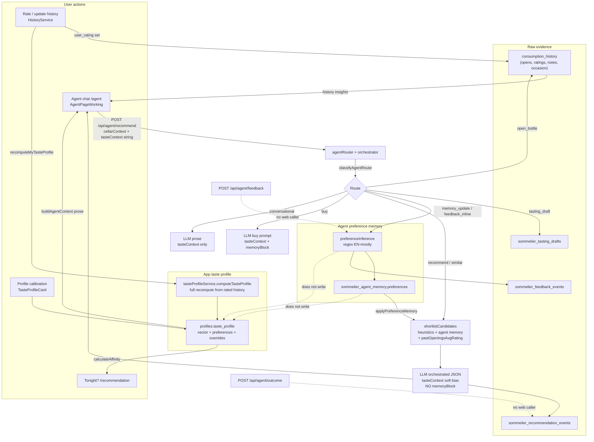

# Agent Taste Profile & Preference Memory — Architecture Audit

**Date:** 2026-09-10  
**Scope:** Read-only inspection of repository code, migrations, and types. No schema changes, no runtime DB queries, no implementation.  
**Product surface:** Sommi Cellar Sommelier (`/agent`) vs app taste profile (`profiles.taste_profile`).

Evidence labels used throughout:

| Label | Meaning |
|---|---|
| **VERIFIED** | Confirmed in active code and/or migrations in this repo |
| **LIKELY** | Strongly suggested by code; needs live Supabase/runtime confirmation |
| **UNKNOWN** | Cannot be confirmed from the repository alone |

---

## A. Executive summary

Sommi today has **two parallel preference systems** that are only loosely coupled:

1. **App taste profile** — structured JSON on `profiles.taste_profile`, recomputed from **rated** `consumption_history` rows, editable via calibration on the Profile page, and used for affinity scoring on `/recommendation`, insights, weekly summary, and as a **prose soft bias** string in agent LLM prompts.
2. **Agent preference memory** — separate JSON on `sommelier_agent_memory.preferences`, updated by **deterministic regex inference** (`memory_update`, `feedback_inline`, and implicit extraction during `recommend`), and used for **heuristic shortlist scoring** (and buy-mode LLM prompt text). It does **not** update `profiles.taste_profile`.

They are **not** the same source of truth. Agent chat learning improves agent shortlists; rating wines improves the app taste profile and Tonight?/insights paths. The user’s proposed principle (“taste profile canonical for stable preferences; agent memory for evidence/context”) is a reasonable target, but **current behavior is closer to the inverse for ranking**: agent shortlist ranking is driven by agent memory (+ per-bottle history averages), while the taste profile mostly influences the LLM’s final wording/selection among an already-filtered shortlist.

---

## B. Current source-of-truth verdict

| Concern | Canonical store today | Verdict |
|---|---|---|
| Stable structural palate (body/tannin/acidity/…) | `profiles.taste_profile.vector` (+ optional `overrides`) | **App taste profile** — **VERIFIED** |
| Region/grape affinities from ratings | `profiles.taste_profile.preferences` | **App taste profile** — **VERIFIED** |
| Explicit chat “remember I like X” | `sommelier_agent_memory.preferences` | **Agent memory only** — **VERIFIED** |
| Short chat feedback (“too heavy”) | `sommelier_feedback_events` + merge into agent memory | **Agent memory** — **VERIFIED**; does **not** touch taste profile |
| Raw evidence (opens, ratings, notes) | `consumption_history` | **Evidence table** — **VERIFIED**; rebuildable into taste profile |
| Recommendation explainability / outcomes | `sommelier_recommendation_events` | Agent audit — **VERIFIED**; outcomes API exists but **no web caller found** |

**Bottom line:** Duplicated preference concepts with different writers/readers. Not fully integrated. Not fully inconsistent at the DB level (different columns), but **product-inconsistent** because learning in chat does not update the same profile used by `/recommendation` and Profile UI.

---

## C. Top five risks

1. **Split brain preferences** — Chat memory ranks agent shortlists; taste profile ranks Tonight? / insights. Explicit “I prefer lighter reds” in chat never updates Profile or `/recommendation`. **Severity: High** — **VERIFIED**
2. **Taste profile ignored by agent shortlist scoring** — `tasteContext` is LLM-only prose; `shortlistCandidates` / `scoreBottleHeuristically` take `SommelierPreferenceMemory`, not `TasteProfile`. Preferences applied **before** LLM only if they live in agent memory. **Severity: High** — **VERIFIED**
3. **Calibration overrides wiped on recompute** — `recomputeMyTasteProfile()` saves a freshly computed profile **without merging** existing `overrides`, and rating flows call it. Manual calibration can silently disappear after the next rated open. **Severity: High** — **VERIFIED**
4. **Hebrew memory route / English-only inference** — `classifyAgentRoute` routes Hebrew “תזכור…” to `memory_update`, but `inferMemoryUpdateFromText` / `inferFeedbackFromText` are English regex only → empty inference → user told to clarify; no write. **Severity: Medium–High** — **VERIFIED**
5. **Dead / unused feedback surfaces** — `POST /api/agent/feedback` and `POST /api/agent/outcome` have no callers under `apps/web`. Feedback persistence depends on chat routing matching short English phrases. **Severity: Medium** — **VERIFIED** (no web callers); outcome usage in production **UNKNOWN**

---

## D. Recommended first implementation step

**Do not add embeddings, streaming, or tool-calling first.**

Smallest safe correctness step:

> **Preserve `overrides` when recomputing `profiles.taste_profile`, and add a single shared “effective preference view” used by both agent shortlist scoring and `/recommendation` affinity — starting by feeding taste-profile regions/grapes/body into agent heuristics without writing new tables.**

See §9 for the phased plan.

---

## E. Open questions requiring live Supabase / runtime verification

1. How many production users have non-empty `sommelier_agent_memory` vs non-null `profiles.taste_profile`? **UNKNOWN**
2. Are Phase-2 sommelier tables present and RLS policies active in production (migration applied)? **LIKELY** if migrations ran; **UNKNOWN** without live check
3. Do any mobile/other clients call `/api/agent/feedback` or `/outcome`? Repo web app does not — **UNKNOWN** for other clients
4. Is credit enforcement currently on, affecting how often memory routes run in practice? **UNKNOWN**
5. Multi-instance rate-limit store: does it cause uneven agent usage across replicas? **LIKELY** from in-memory Map — **UNKNOWN** in deployed topology
6. Can users’ `taste_profile` JSON drift from the COMMENT schema / `taste_profile_version` column in production data? **UNKNOWN**
7. Does agent `markBottleOpened` ever leave ratings empty in ways that systematically starve taste-profile recompute? **LIKELY** yes (open without rating) — confirm volume live

---

## 1. Existing taste-profile system

### 1.1 Where stored

**VERIFIED** — Columns on `public.profiles`:

| Column | Type | Role |
|---|---|---|
| `taste_profile` | `jsonb` nullable | Full profile document |
| `taste_profile_updated_at` | `timestamptz` nullable | Last write time |
| `taste_profile_version` | `int` NOT NULL DEFAULT 1 | Schema version (column-level) |

Migration: `supabase/migrations/20260303_add_taste_profile.sql`

Hand-written TS types: `apps/web/src/types/supabase.ts` (`TasteProfile`, `TasteProfileVector`, `TasteProfilePreferences`) — **VERIFIED** aligned with migration COMMENT.

### 1.2 Shape (structured JSON, not embeddings)

**VERIFIED** combination of:

- Structured numeric **vector** (body, tannin, acidity, oak, sweetness, power) in `[0,1]`
- Structured **preferences** (color biases, style_tags, regions, grapes as weight maps `[-1,1]`)
- Optional **overrides.vector** (manual calibration)
- **confidence** `low|med|high` from rated count
- **data_points** `{ rated_count, last_rated_at }`
- Document `version: 1`

No embeddings. Not free-form prose in storage (prose is **derived** only when building agent context via `buildAgentContext`).

### 1.3 Initial creation

**VERIFIED** — No DB trigger creates it.

- Created when `computeTasteProfile(userId)` finds ≥1 rated history row and `saveTasteProfile` writes it.
- Or when user applies calibration with no existing profile (`applyCalibration` creates a base profile with defaults + overrides).
- Empty cellar / no ratings → `null` profile remains.

### 1.4 Events that update it

| Event | Writer | Path | Evidence |
|---|---|---|---|
| Open bottle **with** `user_rating` | Client | `historyService.markBottleOpened` → `recomputeMyTasteProfile` | **VERIFIED** |
| Update history rating | Client | `historyService.updateConsumptionHistory` → `recomputeMyTasteProfile` | **VERIFIED** |
| Manual recompute | Profile UI | `TasteProfileCard.handleRecompute` → `recomputeMyTasteProfile` | **VERIFIED** |
| Calibration save | Profile UI | `applyCalibration` | **VERIFIED** |
| Reset | Profile UI | `resetTasteProfile` (strip overrides, then recompute) | **VERIFIED** |
| Agent open bottle | API | `markBottleOpened` — **no** taste recompute | **VERIFIED** |
| Agent memory / feedback | API | writes `sommelier_*` only | **VERIFIED** |

### 1.5 Recalculated vs incremental

**VERIFIED** — **Full recalculation** from up to 100 most recent rated `consumption_history` rows (`MAX_HISTORY_ENTRIES = 100`), not incremental mutation of weights.

Functions:

- `computeTasteProfile` — `apps/web/src/services/tasteProfileService.ts`
- `computeVector`, `computePreferences`, `mapRatingToWeight` (5→+1 … 1→−1; 3→0)
- Rating weight × recency weight (min 0.5 over ~1 year) for vector

**Issue (VERIFIED):** `recomputeMyTasteProfile` does not merge prior `overrides` into the saved document → calibration loss on next rating-driven recompute.

### 1.6 Manual edit

**VERIFIED** — Yes, via Profile page `TasteProfileCard`:

- Calibration sliders → `applyCalibration`
- Recompute / Reset buttons

No structured editor for regions/grapes maps (those are inferred only).

### 1.7 UI / feature consumers

| Consumer | File | How used | Evidence |
|---|---|---|---|
| Profile display | `apps/web/src/components/TasteProfileCard.tsx` | Load / recompute / calibrate | **VERIFIED** |
| Tonight? / Recommendation | `apps/web/src/services/recommendationService.ts` | `calculateAffinity` + weighted score bonus | **VERIFIED** |
| Insights pills | `apps/web/src/services/insightService.ts` | Region/grape/structural reasons | **VERIFIED** |
| Open ritual / wine modal | `OpenRitualSheet.tsx`, `WineDetailsModal.tsx` | `getBottleInsight` | **VERIFIED** |
| Weekly summary | `weeklySummaryService.ts`, `WeeklySummaryCard.tsx` | Compare recent opens to profile | **VERIFIED** |
| Agent chat | `agentService.sendAgentMessage` → `buildAgentContext` | Prose string `tasteContext` | **VERIFIED** |

---

## 2. Evidence and source data

### 2.1 Storage map

| Evidence | Table / columns | Evidence label |
|---|---|---|
| Opened bottles / consumption | `consumption_history` (`opened_at`, `opened_quantity`, `status`, `occasion`, `meal_type`, `vibe`, …) | **VERIFIED** — `20251226_initial_schema.sql` + later migrations |
| Ratings | `consumption_history.user_rating` (1–5) | **VERIFIED** |
| Tasting / meal / personal notes | `tasting_notes`, `meal_notes`, `notes` | **VERIFIED** |
| Agent recommendation log | `sommelier_recommendation_events` | **VERIFIED** — `20260328_sommelier_agent_phase2.sql` |
| Agent feedback | `sommelier_feedback_events` (`raw_text`, `structured_tags`, `sentiment`, `preference_delta`) | **VERIFIED** |
| Agent tasting drafts | `sommelier_tasting_drafts` | **VERIFIED** — not merged into taste profile |
| Agent chat transcripts | `sommelier_conversations` | **VERIFIED** (separate migration) |
| Legacy recommendation audit | `recommendation_runs` | **VERIFIED** schema; agent path does **not** write it (**VERIFIED** no agent insert) |

### 2.2 What influences the taste profile

**VERIFIED** — Only:

- Rows with **non-null** `user_rating`
- Joined wine fields: color, region, grapes, `wine_profile` (or heuristic profile)
- Not: tasting note text, meal notes, occasion, vibe, agent feedback, agent memory, wishlist, unrated opens

### 2.3 Positive / negative representation

| System | Positive | Negative |
|---|---|---|
| Taste profile | Rating 4–5 → positive weights; region/grape/style maps can be positive | Rating 1–2 → negative weights; color bias uses positive−negative normalization |
| Agent memory | `favoriteRegions`, `favoriteGrapes`, `preferredStyles`, `bodyPreference` | `dislikedProfiles` strings (`heavy`, `high_acid`, …); arrays **accumulate** via `uniq` |
| Per-bottle history in agent shortlist | `pastOpeningsAvgRating` ≥ 4.25 → +10 | ≤ 2.25 → −10 (`applyPastOpensHistory`) |

### 2.4 Context preservation (food, occasion, price, “not tonight”)

| Context | Stored? | In taste profile? | In agent memory? |
|---|---|---|---|
| Occasion / meal_type / vibe on open | **VERIFIED** on `consumption_history` | **No** | **No** (except open from agent sets `occasion: 'sommelier_agent'`) |
| Food from chat | Extracted per-request as constraints | **No** | **No** long-term |
| Price | Bottle purchase fields; buy tiers are LLM-only | **No** | **No** |
| “Not tonight” / temporary | Not a first-class store | **No** | **No** |
| Recommendation outcome | `sommelier_recommendation_events.outcome` | **No** | Not merged into prefs automatically |

### 2.5 Rebuildability

**VERIFIED** — Taste profile **can** be rebuilt from rated history via `computeTasteProfile` (minus lost overrides if wiped).

Agent memory **cannot** be fully rebuilt from consumption alone — it is a separate accumulate store. Feedback events retain `raw_text` / `preference_delta` and could theoretically rebuild memory (**LIKELY** if one wrote a backfill; **no** rebuild job in repo — **VERIFIED** absent).

### 2.6 Data loss / ambiguous semantics

| Issue | Label | Notes |
|---|---|---|
| Overrides wiped on recompute | **VERIFIED** | See §1.5 |
| Unrated opens never enter profile | **VERIFIED** | Agent open path never sets rating |
| Rating 3 = zero weight | **VERIFIED** | Neutral; does not reinforce or reject |
| Negative region weights exist but UI “top regions” filters `weight > 0` only | **VERIFIED** | Disliked regions invisible in agent taste prose |
| `preferredStyles` / `occasionPreference` never inferred | **VERIFIED** | Fields exist; no writer in `preferenceInference.ts` |
| Hebrew feedback tags not inferred | **VERIFIED** | Route may match; inference English-only |
| Client cellar context capped at 60 bottles | **VERIFIED** | Stale/incomplete cellar view for large cellars |
| `taste_profile` vs column `taste_profile_version` dual versioning | **VERIFIED** | Easy to drift |
| Generated types vs tables | **VERIFIED** | `apps/web/src/types/supabase.ts` includes taste_profile on profiles and `sommelier_conversations`, but **omits** `sommelier_agent_memory`, `sommelier_recommendation_events`, `sommelier_feedback_events`, `sommelier_tasting_drafts` |

---

## 3. Agent memory system

### 3.1 Storage

**VERIFIED** — `public.sommelier_agent_memory`:

| Column | Type |
|---|---|
| `user_id` | UUID PK → `profiles(id)` |
| `preferences` | JSONB NOT NULL DEFAULT `{}` |
| `updated_at` | timestamptz |

Shape (`SommelierPreferenceMemory` in `apps/api/src/services/cellarAgent/sommelierTypes.ts`):

```ts
{
  version: number;
  preferredStyles?: string[];
  dislikedProfiles?: string[];
  favoriteGrapes?: string[];
  favoriteRegions?: string[];
  bodyPreference?: string | null;      // light | medium | full
  occasionPreference?: string | null;  // special | casual | balanced
}
```

### 3.2 `memory_update` end-to-end

**VERIFIED** flow:

1. User message matches `classifyAgentRoute` memory patterns (EN: “remember”, “I prefer”, “I don’t like”, …; HE: “תזכור”, “אני מעדיף”, …) — `agentRouter.ts`
2. `orchestrator.recommendCellar` → `case 'memory_update'`
3. `inferMemoryUpdateFromText(message)` — **deterministic**, not LLM (`preferenceInference.ts`)
4. If empty → user-facing “tell me what to remember” (no DB write)
5. Else `mergeAndSavePreferences(userId, inferred, supabase)` → upsert `sommelier_agent_memory`
6. Reply claims shortlisting will use preferences going forward

**What gets written:** Only keys present in inference result (typically `bodyPreference`, `favoriteRegions`, `favoriteGrapes`). Arrays merge+dedupe lowercase; scalars overwrite.

### 3.3 `feedback_inline` end-to-end

**VERIFIED** flow:

1. Short message (<100 chars), not a question, matches feedback phrases (“too heavy”, “perfect”, HE “כבד מדי”, …)
2. `saveSommelierFeedback` → `inferFeedbackFromText` → insert `sommelier_feedback_events` + optional `mergeAndSavePreferences` when `preferenceDelta` non-empty
3. Does **not** update recommendation `outcome` automatically

**Written to DB:**

- Feedback row: `raw_text`, `structured_tags[]`, `sentiment`, `preference_delta`, optional `recommendation_event_id`, `bottle_id`
- Memory: e.g. `bodyPreference: 'light'`, `dislikedProfiles: ['heavy']` for “too heavy”

### 3.4 Triggers summary

| Trigger | Route | Inference | LLM? |
|---|---|---|---|
| Explicit remember / prefer phrasing | `memory_update` | `inferMemoryUpdateFromText` | No |
| Short reaction phrases | `feedback_inline` | `inferFeedbackFromText` | No |
| During default `recommend` | side-effect before LLM | same as memory update if message matches | No (**implicit_memory** log) |
| `POST /api/agent/feedback` | HTTP | same as feedback_inline | No — **no web caller** |

### 3.5 Merge / expire / contradict

**VERIFIED:**

- **Accumulate** favorite/dislike arrays (`uniq` merge)
- **Overwrite** `bodyPreference` / `occasionPreference` with latest delta
- **No expiry**
- **No conflict resolution** beyond last-write-wins for scalars; contradictory likes/dislikes can coexist (e.g. favorite grape + disliked “heavy” still both stored)
- Does not remove prior favorites when user says “I don’t like X” unless a separate dislike path exists (dislike inference is weak — mostly body/acid tags)

### 3.6 Key files / functions

| Path | Functions |
|---|---|
| `apps/api/src/services/cellarAgent/agentRouter.ts` | `classifyAgentRoute` |
| `apps/api/src/services/cellarAgent/preferenceInference.ts` | `inferMemoryUpdateFromText`, `inferFeedbackFromText` |
| `apps/api/src/services/cellarAgent/sommelierRepo.ts` | `loadSommelierMemory`, `saveSommelierMemory`, `mergeAndSavePreferences`, `insertFeedbackEvent` |
| `apps/api/src/services/cellarAgent/sommelierActions.ts` | `saveSommelierFeedback` |
| `apps/api/src/services/cellarAgent/orchestrator.ts` | route cases + `formatMemoryForPrompt` + implicit merge |
| `apps/api/src/routes/agent.ts` | `/recommend`, `/feedback`, `/outcome` |

---

## 4. Connection between profile and agent

### 4.1 What the client sends

**VERIFIED** — `apps/web/src/services/agentService.ts` `sendAgentMessage`:

| Field | Contents |
|---|---|
| `cellarContext` | Up to 60 bottles + optional history insights (`pastOpenings*`, `pastNotesSummary`) — **not** the taste profile object |
| `tasteContext` | Optional **string** from `tasteProfileService.buildAgentContext(profile)` |
| `history` | Chat turns |
| `actionContext` | `lastEventId`, `lastRecommendationBottleId`, `anchorBottleId` |
| `language` | App language |

Agent memory is **not** loaded on the client; server loads it via user-JWT Supabase.

### 4.2 What reaches `POST /api/agent/recommend`

**VERIFIED** — `agent.ts` passes `tasteContext` string + `cellarContext.bottles` into `recommendCellar`. Server additionally loads `sommelier_agent_memory` and recent recommendation bottle IDs.

### 4.3 What each LLM prompt includes

| Mode | Taste profile (`tasteContext`) | Agent memory | Evidence |
|---|---|---|---|
| Orchestrated recommend / similar | Soft bias block in system prompt | **Not** in prompt text; used only in shortlist scoring | **VERIFIED** — `buildOrchestratedSystemPrompt` has taste; no `memoryBlock` |
| Legacy full-cellar fallback | Soft bias | Not in prompt | **VERIFIED** |
| Buy recommendations | Soft bias | `formatMemoryForPrompt` block | **VERIFIED** |
| Conversational follow-up | Soft bias | Not included | **VERIFIED** |
| Deterministic actions | No LLM | N/A | **VERIFIED** |

### 4.4 Where taste / memory affect selection

| Stage | Taste profile | Agent memory | Per-bottle history averages |
|---|---|---|---|
| (a) Deterministic filtering (color / reserved) | No | No | No |
| (b) Shortlist scoring | **No** | **Yes** (`applyPreferenceMemory`) | **Yes** (`applyPastOpensHistory`) |
| (c) LLM final pick / explanation | Soft prose bias | Buy mode only (explicit); recommend mode only via which bottles appear | Via compact bottle fields in shortlist JSON |
| (d) Conversational answers | Soft prose bias | No | Wine details only |

**VERIFIED** — Preferences from chat affect future agent recommendations primarily through **(b)** shortlist scoring, not by updating the app taste profile.

### 4.5 Do agent interactions update the app profile?

**VERIFIED — No.** Two separate flows:

```
Flow A (app):
  rate wine → consumption_history.user_rating
           → recomputeMyTasteProfile
           → profiles.taste_profile
           → /recommendation affinity, insights, agent tasteContext prose

Flow B (agent):
  chat remember/feedback → sommelier_feedback_events? + sommelier_agent_memory
                        → shortlist heuristics (+ buy prompt)
                        ✗ does not write profiles.taste_profile
```

---

## 5. Identity, security, and integrity

### 5.1 AuthN / AuthZ path (agent API)

**VERIFIED** — `apps/api/src/routes/agent.ts`:

1. Bearer JWT → `supabase.auth.getUser(token)` → `req.userId`
2. Feature flag: user-scoped client reads `profiles.cellar_agent_enabled` for `req.userId`
3. Persistence via `createUserSupabase(req)` — **anon key + user JWT** (RLS applies)
4. Not service-role for agent memory/events writes

### 5.2 RLS

**VERIFIED** in migrations:

| Table | Policy pattern |
|---|---|
| `profiles` | `auth.uid() = id` SELECT/UPDATE/INSERT (`001` / initial schema) |
| `consumption_history` | `auth.uid() = user_id` |
| `sommelier_agent_memory` | FOR ALL `auth.uid() = user_id` |
| `sommelier_recommendation_events` | same |
| `sommelier_feedback_events` | same |
| `sommelier_tasting_drafts` | same |

`protect_profiles_privileges` trigger locks feature flags / admin — **does not** block `taste_profile` writes by the owning user — **VERIFIED**.

### 5.3 Cross-user access

**LIKELY secure** for normal clients: all reads/writes filter `user_id` / `id` and RLS matches `auth.uid()`.

Cross-user read/write via agent API would require forging another user’s JWT — **not** achievable from application code paths inspected. Live policy drift **UNKNOWN**.

`updateRecommendationOutcome` double-filters `.eq('id', eventId).eq('user_id', userId)` — **VERIFIED**.

### 5.4 Free-form agent output writing unsafe data?

**VERIFIED** constraints:

- Memory/feedback writes come from **regex inference**, not raw LLM JSON into memory
- Bottle IDs for recommendations validated against shortlist (`validation.ts` path in orchestrator)
- Draft text truncated (8000); feedback/raw message truncated (4000)
- Open bottle requires UUID / actionContext anchor + ownership check on bottle `user_id`

Residual risks:

- Client-supplied `tasteContext` / `cellarContext` are **trusted as user-owned context** but could be manipulated by the authenticated user (self-spoof of own cellar/taste prose) — expected for this architecture; server does not re-fetch cellar from DB on recommend — **VERIFIED**
- Injected prose in `tasteContext` could bias the model; no schema validation on that string — **VERIFIED**
- Implicit memory on recommend can write prefs from any recommend-routed message that matches English patterns — unintentional preference pollution — **VERIFIED**

---

## 6. Conflicts and duplication

| Concept | Current source(s) of truth | Writers | Readers | Duplication / conflict risk | Observed issue | Severity |
|---|---|---|---|---|---|---|
| Structural palate vector | `profiles.taste_profile.vector` (+ overrides) | `tasteProfileService` recompute/calibrate | Recommendation affinity, insights, agent prose | Medium | Agent shortlist ignores vector | High |
| Region/grape likes | Taste `preferences.*` **and** agent `favoriteRegions/Grapes` | Ratings vs chat inference | Different surfaces | **High** | Same concept, two stores, can diverge | High |
| Body preference | Taste vector body **and** agent `bodyPreference` | Ratings vs “too heavy” / “prefer light” | Agent heuristics vs LLM prose | **High** | Chat “lighter” won’t move Profile UI | High |
| Dislikes | Negative taste weights; agent `dislikedProfiles` | Ratings; feedback tags | Partial | Medium | Agent dislikes never enter taste profile | Medium |
| Consumption ratings | `consumption_history.user_rating` | History UI, open ritual; not agent open | Taste recompute; history insights | Low (single table) | Unrated agent opens skip profile | Medium |
| Recommendation audit | `sommelier_recommendation_events` vs legacy `recommendation_runs` | Agent vs Tonight? path | Analytics / diversity | Medium | Two audit systems | Low–Med |
| Feedback | Chat route + unused `/feedback` API | Orchestrator; API orphan | Memory merge | Medium | API unused; outcomes unused in web | Medium |
| Client cellar snapshot | Request `cellarContext` | Client each turn | Agent scoring/LLM | Medium | Can be stale vs DB; capped at 60 | Medium |
| Preference application timing | Agent memory pre-LLM; taste post-shortlist (LLM only) | — | — | **High** | Taste cannot rescue bottles never shortlisted | High |
| Types vs migrations | Hand-written `supabase.ts` | Devs | TS clients | Medium | Phase-2 sommelier tables missing from types | Low–Med |
| Legacy agent pages | `AgentPage.tsx`, `AgentPageSimple.tsx` | Unused routes? | — | Low | Dead-code risk; App uses `AgentPageWorking` (**LIKELY** — confirm router) | Low |
| Docs vs code | `CELLAR_AGENT_SUMMARY.md` etc. | — | Humans | Low | Still say localhost/GPT-4o | Low |

### Specific checklist

| Check | Result |
|---|---|
| Separate taste profiles by feature | **Yes** — app JSON vs agent memory JSON — **VERIFIED** |
| Prose memory contradicting structured prefs | Taste prose can say “favorite regions X” while agent memory favors Y — **VERIFIED** possible |
| Duplicate rating/consumption sources | Single `consumption_history`; agent open is alternate **writer** to same table — **VERIFIED** |
| Stale client-built context | **VERIFIED** client builds cellar+taste each send; no server re-read of profile/cellar |
| Agent writes that don’t affect future recs | Feedback with **no** matching English tags → event may still insert but empty delta; HE memory route with null inference → **no** write — **VERIFIED** |
| Prefs only after shortlist | Taste profile: **yes** (LLM only). Agent memory: **no** (pre-shortlist) — **VERIFIED** |
| Generated types mismatch | Phase-2 tables missing from web types — **VERIFIED**; taste_profile present |
| Legacy active-but-unused | `/feedback` + `/outcome` unused by web; `preferredStyles`/`occasionPreference` unused by inference; old Agent pages — **VERIFIED** / **LIKELY** |

---

## 7. Current architecture diagram

Only paths verified in code. Dashed = weak / unused / dead.



**Uncertain / dead (marked dashed):** `/feedback`, `/outcome` web usage; whether old Agent pages are routed.

---

## 8. Recommended target architecture

Assessment of the user’s proposed principle after inspection:

> “The application taste profile is the canonical source of truth for stable wine preferences, while agent conversation memory stores evidence, conversational context, and non-taste facts.”

**This is a good fit for the codebase**, with one refinement:

- Keep **raw evidence** in `consumption_history` + `sommelier_feedback_events` + recommendation events (append-only).
- Keep **stable taste** in `profiles.taste_profile` (structured), rebuilt from evidence + explicit high-confidence statements.
- Use agent memory (or a renamed “session/context” store) for: last anchors, temporary constraints (“keep reserved tonight”), conversational facts that are **not** palate traits, and pending evidence awaiting confirmation.
- **All** recommendation surfaces (agent shortlist, Tonight?, insights) should read the **same effective preference view**.

### 8.1 Reuse as-is

- `consumption_history` as evidence spine
- RLS ownership patterns (user JWT for agent writes)
- Deterministic routing skeleton (`classifyAgentRoute`)
- Shortlist + validate bottleId anti-hallucination loop
- Taste vector / preferences JSON schema (version 1)
- Feedback events table as evidence log

### 8.2 Refactor

- Single **EffectivePreferences** builder used by `scoreBottleHeuristically` and `recommendationService`
- Include taste profile regions/grapes/body in agent shortlist scoring
- Preserve overrides on recompute
- Map high-confidence agent statements into taste profile (or into a `explicit_statements` section inside `taste_profile`) instead of a second competing store
- Narrow agent memory to non-taste / ephemeral fields
- Stop implicit memory writes on every recommend without user-facing confirmation (or gate by confidence)
- Wire `/feedback` + `/outcome` from UI **or** delete/deprecate endpoints
- Hebrew parity for inference
- Server-side optional re-fetch of taste profile (don’t trust only client prose for scoring)

### 8.3 Migrate / backfill

- One-time: project `sommelier_agent_memory` favorites/dislikes into taste profile preferences **or** into `taste_profile.explicit` with provenance
- Preserve existing memory rows for rollback
- Fix any profiles that lost `overrides` if recoverable from… (**UNKNOWN** — likely unrecoverable unless clients logged them)

### 8.4 Remove / deprecate

- Competing use of agent memory as long-term palate store (after migration)
- Unused `preferredStyles` / `occasionPreference` **or** implement writers properly
- Legacy docs claiming localhost-only agent
- Possibly legacy `AgentPage*.tsx` if unrouted

### 8.5 Postpone

- Embeddings / vector search over cellar
- OpenAI tool-calling for memory
- Streaming
- New preference UI beyond fixing calibration integrity
- Cross-user collaborative filtering

---

## 9. Implementation plan — no implementation

### Phase 0 — Correctness hotfix (smallest safe change)

**Goal:** Stop silent data loss; do not change product semantics yet.

| Item | Detail |
|---|---|
| Change | `recomputeMyTasteProfile` / `save` path must **merge existing `overrides`** (and optionally preserve `explicit` later) when recomputing from ratings |
| Files | `apps/web/src/services/tasteProfileService.ts`; tests if any; `TasteProfileCard` acceptance |
| Migration | **No** |
| Compatibility | Existing profiles unchanged until next recompute |
| Security | Unchanged (same RLS update) |
| Tests | Unit: recompute keeps overrides; rating 5 still updates vector |
| Acceptance | Calibrate → rate a wine → reload Profile → overrides still present |
| Rollback | Revert single service function |

### Phase 1 — Unify read path for ranking (no new SoT yet)

**Goal:** Agent shortlist and Tonight? both consume taste profile structured fields.

| Item | Detail |
|---|---|
| Change | Build shared mapper: `TasteProfile` → heuristic boosts (regions/grapes/body/color bias). Call from `scoreBottleHeuristically` **in addition to** agent memory (memory can remain, with lower weight or same) |
| Files | New shared module under `apps/api` **or** duplicate thin mapper + later extract; `heuristics.ts`, `candidateSelection.ts`, `orchestrator.ts`; optionally pass structured taste from client or fetch server-side from `profiles` |
| Prefer | Server fetch `profiles.taste_profile` with user JWT inside `/recommend` so scoring isn’t prose-only |
| Migration | **No** |
| Compatibility | Rankings may shift; monitor recommendation events |
| Security | Server read own profile via RLS |
| Tests | Fixture profile boosts matching region bottles; empty profile no-op |
| Acceptance | User with Bordeaux affinity in Profile sees Bordeaux rise in agent shortlist explainability (`mem_`/`taste_` features) |
| Rollback | Feature flag or weight=0 |

### Phase 2 — Unify write path for explicit statements

**Goal:** `memory_update` / strong feedback update canonical taste profile (structured), and log evidence in `sommelier_feedback_events`.

| Item | Detail |
|---|---|
| Change | On successful inference, write evidence event + update `profiles.taste_profile` explicit/prefs; demote `sommelier_agent_memory` to cache or ephemeral |
| Files | `sommelierActions.ts`, `orchestrator.ts`, `tasteProfileService` (or API-side recompute helpers), types |
| Migration | **Optional** — add `taste_profile.explicit` keys via JSON convention (no column change) **or** small columns later |
| Backfill | Copy agent memory favorites into taste explicit with `source: 'agent_memory_v1'` |
| Security | Still user JWT; validate enum/whitelist for bodyPreference; cap array sizes |
| Tests | “I prefer lighter wines” updates profile body override/explicit and affects Phase-1 scoring |
| Acceptance | Profile UI reflects chat preference after refresh; Tonight? also shifts |
| Rollback | Keep dual-write to agent memory during transition |

### Phase 3 — Housekeeping

- Hebrew inference parity
- Remove or wire `/feedback` + `/outcome`
- Add missing tables to generated/hand-written types
- Stop implicit memory on recommend or require explicit confirm
- Update docs; deprecate dead Agent pages
- Consider including tasting-note sentiment later (**postpone** NLP)

### Priority order (as requested)

1. Source-of-truth / correctness (Phase 0–2)  
2. Only then: richer inference, embeddings, tool-calling, streaming, new UI

---

## 10. Evidence quality index (key conclusions)

| Conclusion | Label |
|---|---|
| Two preference stores exist (`profiles.taste_profile` vs `sommelier_agent_memory`) | **VERIFIED** |
| Taste profile recomputed from rated consumption history (≤100) | **VERIFIED** |
| Agent memory updated by deterministic regex, not LLM JSON | **VERIFIED** |
| Agent shortlist uses agent memory, not taste profile vector | **VERIFIED** |
| Taste profile reaches agent as prose `tasteContext` in LLM prompts | **VERIFIED** |
| Buy prompt includes both taste prose and memory block | **VERIFIED** |
| Orchestrated recommend prompt does **not** include memory block | **VERIFIED** |
| Agent chat does not update `profiles.taste_profile` | **VERIFIED** |
| Tonight? uses taste affinity scoring | **VERIFIED** |
| Calibration overrides can be wiped by recompute | **VERIFIED** |
| Hebrew memory route with English-only inference gap | **VERIFIED** |
| Web app does not call `/api/agent/feedback` or `/outcome` | **VERIFIED** |
| RLS policies intended to scope by `auth.uid()` | **VERIFIED** in migrations |
| Production migration application / row counts | **UNKNOWN** |
| Other clients calling feedback/outcome APIs | **UNKNOWN** |
| Live cross-user isolation under current deployed policies | **LIKELY** OK; confirm live |

---

## Appendix — Primary file index

| Area | Paths |
|---|---|
| Taste profile | `apps/web/src/services/tasteProfileService.ts`, `apps/web/src/components/TasteProfileCard.tsx`, `apps/web/src/types/supabase.ts`, `supabase/migrations/20260303_add_taste_profile.sql` |
| Evidence / history | `apps/web/src/services/historyService.ts`, `supabase/migrations/20251226_initial_schema.sql`, `20260102120000_add_notes_to_consumption_history.sql`, `20260823_phase0_batch2_inventory_rpcs.sql` |
| Agent client | `apps/web/src/services/agentService.ts`, `apps/web/src/pages/AgentPageWorking.tsx` |
| Agent server | `apps/api/src/routes/agent.ts`, `orchestrator.ts`, `agentRouter.ts`, `preferenceInference.ts`, `sommelierRepo.ts`, `sommelierActions.ts`, `heuristics.ts`, `candidateSelection.ts`, `prompt.ts` |
| Agent schema | `supabase/migrations/20260328_sommelier_agent_phase2.sql` |
| Other consumers | `recommendationService.ts`, `insightService.ts`, `weeklySummaryService.ts` |

---

*End of audit. No code, schema, prompts, or configuration were modified beyond adding this document.*
